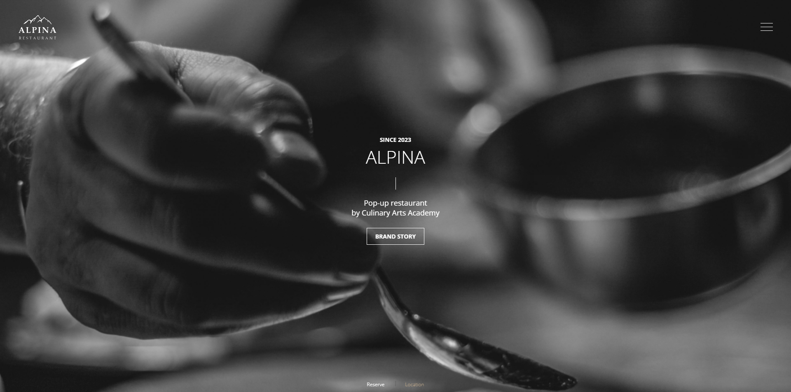

## Alpina restaurant(Brig,switzerland) 홈페이지 리디자인 및 퍼블리싱

### 0.Alpina restaurant 홈페이지

사용기술: JavaScript, GSAP, jQuery

작업기간: 2024.06.18 ~ 2024. 06.26

작업유형: 개인 프로젝트(기여도 100%)

---

### 1. 이 프로젝트를 통해 얻고자 하는 게 무엇인가?

- 디자인 감각을 한층 더 끌어 올리고 싶었다.
- 전달하고자 하는 내용을 효과적으로 전달하고 싶었다.

---

### 2. 프로젝트를 하며 느낀 점

- 

<a href="https://minseong0000.github.io/Alpina/" target="_blank">Alpina restaurant</a>

